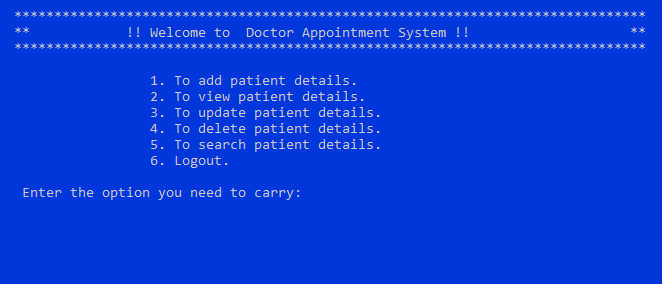
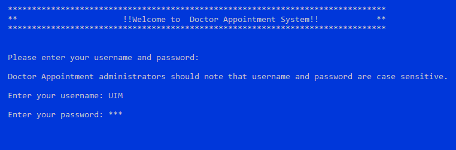

# Doctor Appointment System Using Oracle Proc
The project **Doctor Appointment System** manages the patient’s appointment easily and efficiently. It can perform the following functions:-

* Add Patient Details.
* View Patient Details.
* Update Patient Details.
* Delete Patient Details.
* Search Patient Details.



Doctor Appointment System can lead to error free, secure, reliable and fast management system. It can assist the user to concentrate on their other activities rather to concentrate on the manual record keeping. Thus it will help organization in better utilization of resources.

## Objectives

* It tracks and manage the information of patient’s appointment and makes editing, adding, searching and updating of records easier which results in proper resource management of doctor data. 

* Easy access of saved data inside the system and remove the possibility of redundant entries.

* It saves the time and provide security from unauthorized access.

## System Analysis

### Existing System

* Adding record is not easy as the user has to scroll down to the end of the document to enter a new record or needs to find the alphabetically correct position to enter a new record.

* Records saved in a file/document are vulnerable as the file /document can easily be misplaced or can be deleted accidentally.

### Proposed System

* Computerized system to save patient's data and number of copies can be easily generated at a time.

* It creates user friendly environment where a normal user can access through all the benefits of the system.

## Programming Languages and Technologies Used

* Oracle Proc (To connect sql with c program).
* C language.

## [Guide to Proc Compiler](https://docs.oracle.com/cd/A57673_01/DOC/api/doc/PC_22/ch03a.htm)


## Software Requirements

* Oracle Sql 10g version installed.
* Use the following code for table schema:-

```sql
create table doc(
p_id number(5) primary key,
p_name varchar2(30) not null,
p_gender varchar2(10) not null,
p_age number(2) not null,
p_address varchar2(80),
p_contactno number(10) not null,
p_appdate date
);
```
## List of Reports

### Login Screen



### Insert Details Module
### Update Details Module
### Delete Details Module
### Search Details Module

## Future Scope and Further Enhancement 

* In future a web application of this project can be developed so that patient can book appointment online.

* Application can be modified to export the records of a patients in printable format or transferable format which can be added to application in another computer.


